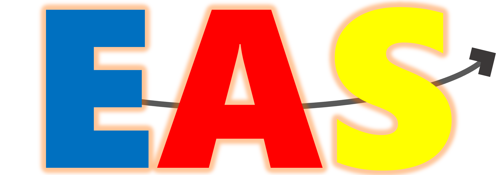

<p align="center">
    
</p>

<h3 align="center">Electoral Analysis System</h3>

<p align="center">
A Python-Flask web app for analysing elections.
</p>

## ❓ What is the EAS?
EAS is a web app that allows you to analyse elections with ease through an intuitive graphical interface. It automates the process of sourcing, calculating, abstracting, and visually presenting electoral statistics.

EAS relies heavily on <a href="https://www.electionguide.org">ElectionGuide</a> to source its data. This project would not be possible without their contributions.

I plan to eventually deploy the app on a Raspberry Pi server, once the first prototype is complete.

This project also serves as my coursework for the OCR A Level Computer Science NEA. As a result, I cannot accept contributions until after it has been submitted. However, feel free to clone and experiment with the EAS for your own learning.

## 📋 Requirements
To run EAS, you will need:
- Python 3.x with pip

Dependencies will be installed during the setup process.

## ⚙️ Installation and Launch
**Note: At the time of writing, the project is launchable but no features are present!**

To set up EAS, clone the repository and use a virtual environment. (You may need to use `python3` depending on your system configuration.)

1. **Clone the repository:**
   ```bash
   git clone https://github.com/doctorisyes/Electoral-Analysis-System.git
   cd Electoral-Analysis-System
   ```

2. **Create and activate a virtual environment:**
   ```bash
   python -m venv venv
   source venv/bin/activate  # On Windows: venv\Scripts\activate
   ```

3. **Install dependencies:**
   ```bash
   pip install -r requirements.txt
   ```

4. **Run the program:**
   ```bash
   python main.py
   ```

## 📦 Dependencies
The backend uses the following libraries:
- Flask
- requests
- Pywebview
*(More to be added as the project develops.)*

## 🤝 Contributing
As this project is coursework, I cannot accept contributions until it has been submitted to OCR.

## ⚖️ License
This repository uses the **Creative Commons Attribution-NoDerivatives 4.0 International (CC BY-ND 4.0)** license.

## 🧑‍💻 Author
**Samuel Douek** – [@doctorisyes](https://github.com/doctorisyes)
